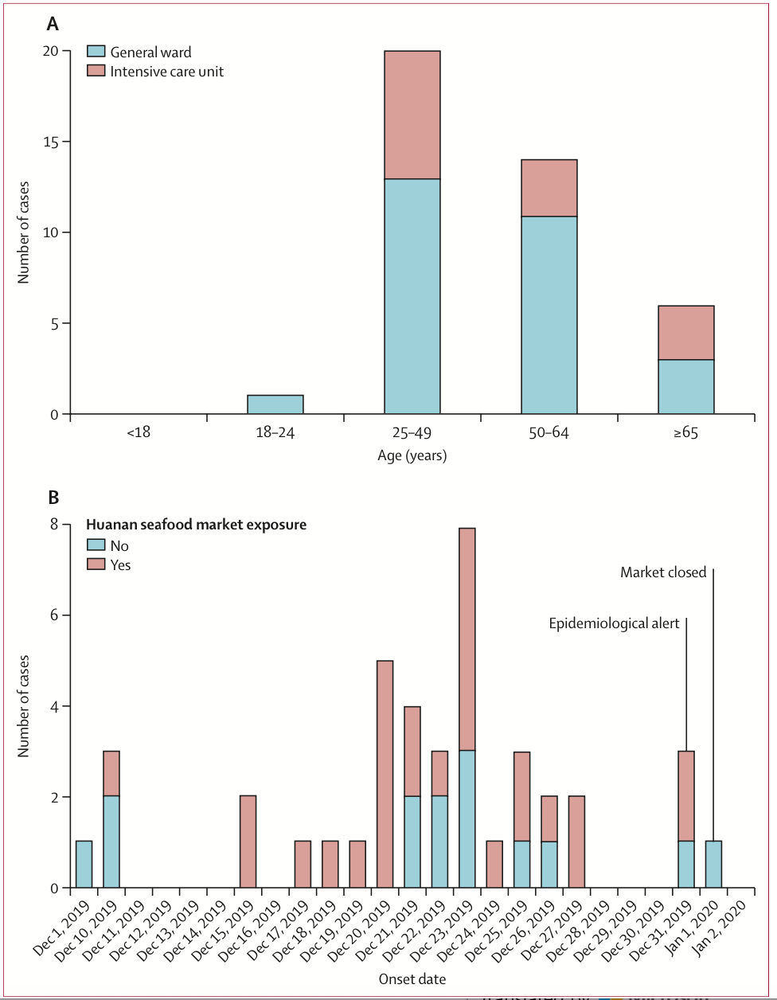
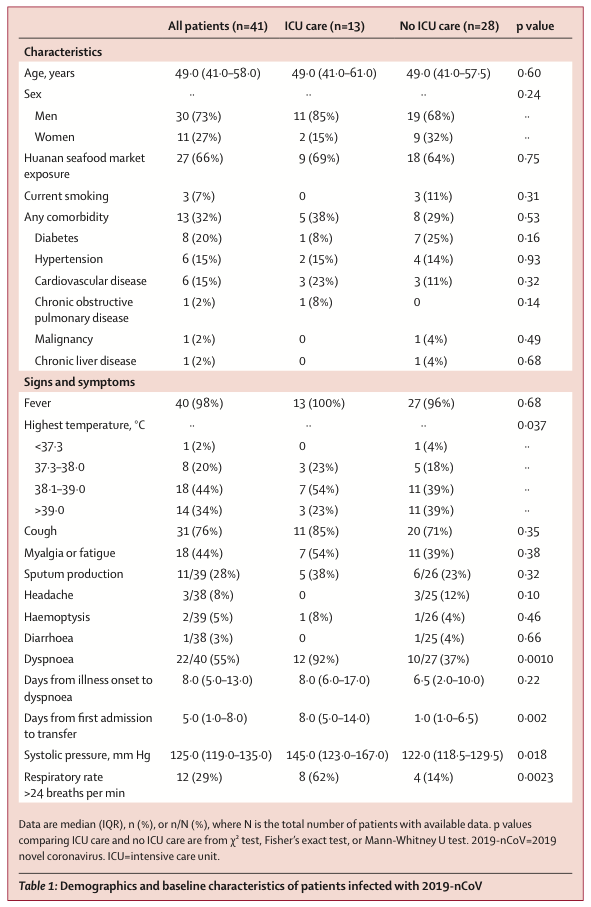
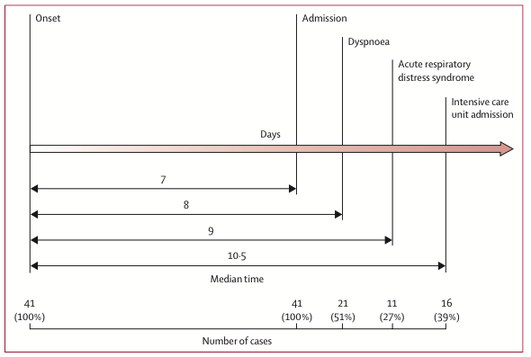
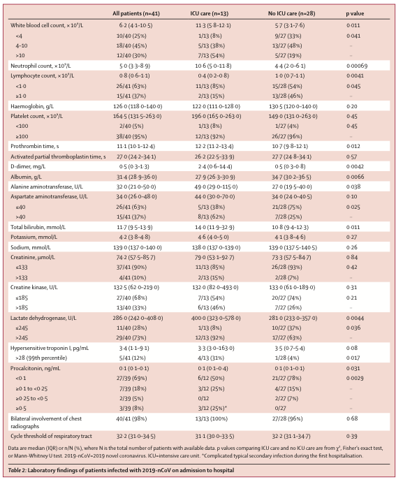
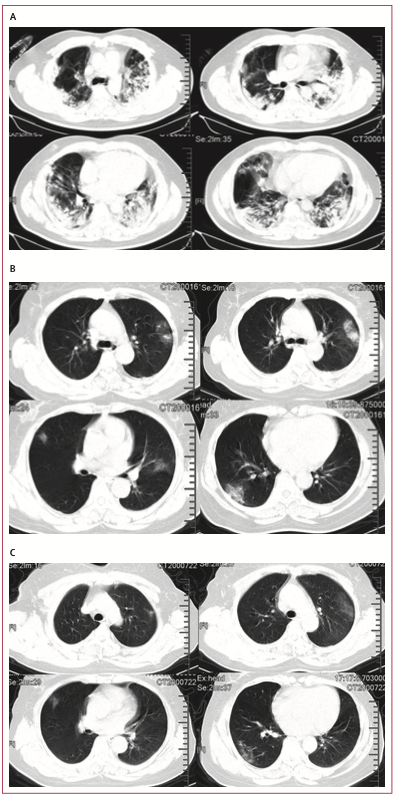
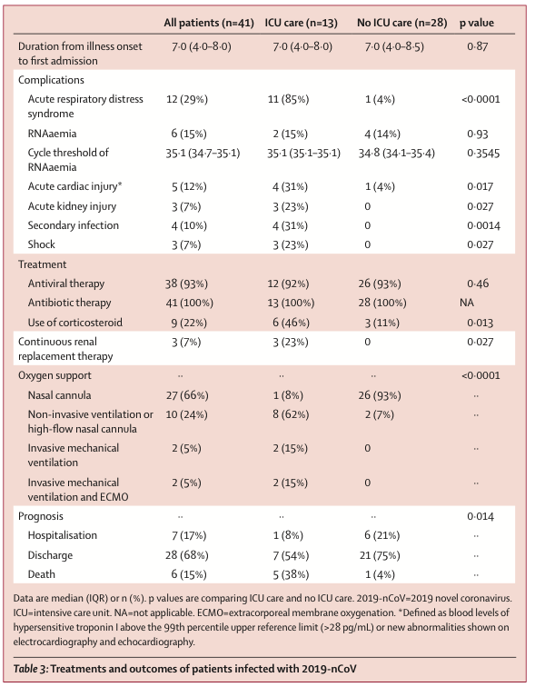

# Clinical features of patients infected with 2019 novel coronavirus in Wuhan, China

2019中国武汉新型感染冠状病毒感染者的临床特征

Chaolin Huang\*, Yeming Wang\*, Xingwang Li\*, Lili Ren\*, Jianping Zhao\*, Yi Hu\*, Li Zhang, Guohui Fan, Jiuyang Xu, Xiaoying Gu, Zhenshun Cheng, Ting Yu, Jiaan Xia, Yuan Wei, Wenjuan Wu, Xuelei Xie, Wen Yin, Hui Li, Min Liu, Yan Xiao, Hong Gao, Li Guo, Jungang Xie, Guangfa Wang, Rongmeng Jiang, Zhancheng Gao, Qi Jin, Jianwei Wang†, Bin Cao†

## Summary
**Background** **A recent cluster of pneumonia cases in Wuhan, China, was caused by a novel betacoronavirus, the 2019 novel coronavirus (2019-nCoV). We report the epidemiological, clinical, laboratory, and radiological characteristics and treatment and clinical outcomes of these patients.** 

**Methods** **All patients with suspected 2019-nCoV were admitted to a designated hospital in Wuhan. We prospectively collected and analysed data on patients with laboratory-confirmed 2019-nCoV infection by real-time RT-PCR and next-generation sequencing. Data were obtained with standardised data collection forms shared by the International Severe Acute Respiratory and Emerging Infection Consortium from electronic medical records. Researchers also directly communicated with patients or their families to ascertain epidemiological and symptom data. Outcomes were also compared between patients who had been admitted to the intensive care unit (ICU) and those who had not.** 

**Findings** **By Jan 2, 2020, 41 admitted hospital patients had been identified as having laboratory-confirmed 2019-nCoV infection. Most of the infected patients were men (30 [73%] of 41); less than half had underlying diseases (13 [32%]), including diabetes (eight [20%]), hypertension (six [15%]), and cardiovascular disease (six [15%]). Median age was 49·0 years (IQR 41·0–58·0). 27 (66%) of 41 patients had been exposed to Huanan seafood market. One family cluster was found. Common symptoms at onset of illness were fever (40 [98%] of 41 patients), cough (31 [76%]), and myalgia or fatigue (18 [44%]); less common symptoms were sputum production (11 [28%] of 39), headache (three [8%] of 38), haemoptysis (two [5%] of 39), and diarrhoea (one [3%] of 38). Dyspnoea developed in 22 (55%) of 40 patients (median time from illness onset to dyspnoea 8·0 days [IQR 5·0–13·0]). 26 (63%) of 41 patients had lymphopenia. All 41 patients had pneumonia with abnormal findings on chest CT. Complications included acute respiratory distress syndrome (12 [29%]), RNAaemia (six [15%]), acute cardiac injury (five [12%]) and secondary infection (four [10%]). 13 (32%) patients were admitted to an ICU and six (15%) died. Compared with non-ICU patients, ICU patients had higher plasma levels of IL2, IL7, IL10, GSCF, IP10, MCP1, MIP1A, and TNFα.** 

**Interpretation** **The 2019-nCoV infection caused clusters of severe respiratory illness similar to severe acute respiratory syndrome coronavirus and was associated with ICU admission and high mortality. Major gaps in our knowledge of the origin, epidemiology, duration of human transmission, and clinical spectrum of disease need fulfilment by future studies.** 

**Funding** **Ministry of Science and Technology, Chinese Academy of Medical Sciences, National Natural Science Foundation of China, and Beijing Municipal Science and Technology Commission.** 

**Copyright** **© 2020 Elsevier Ltd. All rights reserved.** 

##Introduction 

Coronaviruses are enveloped non-segmented positive- sense RNA viruses belonging to the family Coronaviridae and the order Nidovirales and broadly distributed in humans and other mammals.1 Although most human coronavirus infections are mild, the epidemics of the two betacoronaviruses, severe acute respiratory syndrome coronavirus (SARS-CoV) 2,4 and Middle East respiratory syndrome coronavirus (MERS-CoV),5,6 have caused more than 10000 cumulative cases in the past two decades, with mortality rates of 10% for SARS-CoV and 37% for MERS-CoV.7,8 The coronaviruses already identified might only be the tip of the iceberg, with potentially more novel and severe zoonotic events to be revealed. 

In December, 2019, a series of pneumonia cases of unknown cause emerged in Wuhan, Hubei, China, with clinical presentations greatly resembling viral pneumonia.9 Deep sequencing analysis from lower respiratory tract samples indicated a novel coronavirus, which was named 2019 novel coronavirus (2019-nCoV). Thus far, more than 800 confirmed cases, including in health-care workers, have been identified in Wuhan, and several exported cases have been confirmed in other provinces in China, and in Thailand, Japan, South Korea, and the USA.10–13 

**Research in context** 

**Evidence before this study** 

Human coronaviruses, including hCoV-229E, OC43, NL63,
 and HKU1, cause mild respiratory diseases. Fatal coronavirus infections that have emerged in the past two decades are severe acute respiratory syndrome coronavirus (SARS-CoV) and the Middle East respiratory syndrome coronavirus. We searched PubMed and the China National Knowledge Infrastructure database for articles published up to Jan 11, 2020, using the keywords “novel coronovirus”, “2019 novel coronavirus”,
 or “2019-nCoV”. No published work about the human infection caused by the 2019 novel coronavirus (2019-nCoV) could be identified. 

**Added value of this study** 

We report the epidemiological, clinical, laboratory, and radiological characteristics, treatment, and clinical outcomes of 41 laboratory-confirmed cases infected with 2019-nCoV. 

27 (66%) of 41 patients had a history of direct exposure to the Huanan seafood market. The median age of patients was
 49·0 years (IQR 41·0–58·0), and 13 (32%) patients had underlying disease. All patients had pneumonia. A third of patients were admitted to intensive care units, and six died. High concentrations of cytokines were recorded in plasma of critically ill patients infected with 2019-nCoV. 

**Implications of all the available evidence** 

2019-nCoV caused clusters of fatal pneumonia with clinical presentation greatly resembling SARS-CoV. Patients infected with 2019-nCoV might develop acute respiratory distress syndrome, have a high likelihood of admission to intensive care, and might die. The cytokine storm could be associated with disease severity. More efforts should be made to know the whole spectrum and pathophysiology of the new disease. 

We aim to describe epidemiological, clinical, laboratory, and radiological characteristics, treatment, and outcomes of patients confirmed to have 2019-nCoV infection, and to compare the clinical features between intensive care unit (ICU) and non-ICU patients. We hope our study findings will inform the global community of the emergence of this novel coronavirus and its clinical features. 

#Methods 

**Patients**

Following the pneumonia cases of unknown cause reported in Wuhan and considering the shared history of exposure to Huanan seafood market across the patients, an epidemiological alert was released by the local health authority on Dec 31, 2019, and the market was shut down on Jan 1, 2020. Meanwhile, 59 suspected cases with fever and dry cough were transferred to a designated hospital starting from Dec 31, 2019. An expert team of physicians, epidemiologists, virologists, and government officials was soon formed after the alert. 

Since the cause was unknown at the onset of these emerging infections, the diagnosis of pneumonia of unknown cause in Wuhan was based on clinical characteristics, chest imaging, and the ruling out of common bacterial and viral pathogens that cause pneumonia. Suspected patients were isolated using airborne precautions in the designated hospital, Jin Yin- tan Hospital (Wuhan, China), and fit-tested N95 masks and airborne precautions for aerosol-generating procedures were taken. This study was approved by the National Health Commission of China and Ethics Commission of Jin Yin-tan Hospital (KY-2020-01.01). Written informed consent was waived by the Ethics Commission of the designated hospital for emerging infectious diseases. 

**Procedures**

Local centres for disease control and prevention collected respiratory, blood, and faeces specimens, then shipped them to designated authoritative laboratories to detect the pathogen (NHC Key Laboratory of Systems Biology of Pathogens and Christophe Mérieux Laboratory, Beijing, China). A novel coronavirus, which was named 2019-nCoV, was isolated then from lower respiratory tract specimen and a diagnostic test for this virus was developed soon after that.14 Of 59 suspected cases, 41 patients were confirmed to be infected with 2019-nCoV. The presence of 2019-nCoV in respiratory specimens was detected by next- generation sequencing or real-time RT-PCR methods. The primers and probe target to envelope gene of CoV were used and the sequences were as follows: forward primer 5′-TCAGAATGCCAATCTCCCCAAC-3′; reverse primer 5′-AAAGGTCCACCCGATACATTGA-3′; and the probe 5′CY5-CTAGTTACACTAGCCATCCTTACTGC-3′BHQ1. Conditions for the amplifications were 50°C for 15 min, 95°C for 3 min, followed by 45 cycles of 95°C for 15 s and 60°C for 30 s. 

Initial investigations included a complete blood count, coagulationprofile,andserumbiochemicaltest(including renalandliverfunction,creatinekinase,lactatedehydro- genase, and electrolytes). Respiratory specimens, including nasal and pharyngeal swabs, bronchoalveolar lavage fluid, sputum, or bronchial aspirates were tested for common viruses, including influenza, avian influenza, respiratory syncytial virus, adenovirus, parainfluenza virus, SARS-CoV andMERS-CoVusingreal-timeRT-PCRassaysapproved by the China Food and Drug Administration. Routine bacterialandfungalexaminationswerealsoperformed. 

Given the emergence of the 2019-nCoV pneumonia cases during the influenza season, antibiotics (oral and intravenous) and oseltamivir (orally 75 mg twice daily) were empirically administered. Corticosteroid therapy 

(methylprednisolone 40–120 mg per day) was given as a combined regimen if severe community-acquired pneumonia was diagnosed by physicians at the designated hospital. Oxygen support (eg, nasal cannula and invasive mechanical ventilation) was administered to patients according to the severity of hypoxaemia. Repeated tests for 2019-nCoV were done in patients confirmed to have 2019-nCoV infection to show viral clearance before hospital discharge or discontinuation of isolation. 

**Data collection** 

We reviewed clinical charts, nursing records, laboratory findings, and chest x-rays for all patients with laboratory- confirmed 2019-nCoV infection who were reported by the local health authority. The admission data of these patients was from Dec 16, 2019, to Jan 2, 2020. Epidemiological, clinical, laboratory, and radiological characteristics and treatment and outcomes data were obtained with standardised data collection forms (modified case record form for severe acute respira- tory infection clinical characterisation shared by the International Severe Acute Respiratory and Emerging Infection Consortium) from electronic medical records. Two researchers also independently reviewed the data collection forms to double check the data collected. To ascertain the epidemiological and symptom data, which were not available from electronic medical records, the researchers also directly communicated with patients or their families to ascertain epidemiological and symptom data. 

**Cytokine and chemokine measurement** 

To characterise the effect of coronavirus on the production of cytokines or chemokines in the acute phase of the illness, plasma cytokines and chemokines (IL1B, IL1RA, IL2, IL4, IL5, IL6, IL7, IL8 (also known as CXCL8), IL9, IL10, IL12p70, IL13, IL15, IL17A, Eotaxin (also known as CCL11), basic FGF2, GCSF (CSF3), GMCSF (CSF2), IFNγ, IP10 (CXCL10), MCP1 (CCL2), MIP1A (CCL3), MIP1B (CCL4), PDGFB, RANTES (CCL5), TNFα, and VEGFA were measured using Human Cytokine Standard 27-Plex Assays panel and the Bio-Plex 200 system (Bio-Rad, Hercules, CA, USA) for all patients according to the manufacturer’s instructions. The plasma samples from four healthy adults were used as controls for cross- comparison. The median time from being transferred to a designated hospital to the blood sample collection was 4 days (IQR 2–5). 

**Detection of coronavirus in plasma** 

Each 80 μL plasma sample from the patients and contacts was added into 240 μL of Trizol LS (10296028; Thermo Fisher Scientific, Carlsbad, CA, USA) in the Biosafety Level 3 laboratory. Total RNA was extracted by Direct-zol RNA Miniprep kit (R2050; Zymo research, Irvine, CA, USA) according to the manufacturer’s instructions and 

50 μL elution was obtained for each sample. 5 μL RNA was used for real-time RT-PCR, which targeted the *NP* gene using AgPath-ID One-Step RT-PCR Reagent (AM1005; Thermo Fisher Scientific). The final reaction mix concentration of the primers was 500 nM and probe was 200 nM. Real-time RT-PCR was performed using the following conditions: 50°C for 15 min and 95°C for 3 min, 50 cycles of amplification at 95°C for 10 s and 60°C for 45 s. Since we did not perform tests for detecting infectious virus in blood, we avoided the term viraemia and used RNAaemia instead. RNAaemia was defined as a positive result for real-time RT-PCR in the plasma sample. 

 

***Figure 1: Date of illness onset and age distribution of patients with laboratory-confirmed 2019-nCoV infection***
(A) Number of hospital admissions by age group. (B) Distribution of symptom onset date for laboratory-confirmed cases. The Wuhan local health authority issued an epidemiological alert on Dec 30, 2019, and closed the Huanan seafood market 2 days later. 

**Definitions**

Acute respiratory distress syndrome (ARDS) and shock were defined according to the interimguidance of WHO for novel coronavirus.9 Hypoxaemia was defined as arterial oxygen tension (PaO2) over inspiratory oxygen fraction (FIO2) of less than 300 mm Hg.15 Acute kidney injury was identified and classified on the basis of the highest serum creatinine level or urine output criteria according to the kidney disease improving global outcomes classification.16 Secondary infection was diagnosed if the patients had clinical symptoms or signs of nosocomial pneumonia or bacteraemia, and was combined with a positive culture of a new pathogen from a lower respiratory tract specimen (including the sputum, transtracheal aspirates, or bron- choalveolar lavage fluid, or from blood samples taken ≥48 h 

after admission).17 Cardiac injury followed the definition used in our previous study in H7N9 patients.18 In brief, cardiac injury was diagnosed if serum levels of cardiac biomarkers (eg, troponin I) were above the 99th percentile upper reference limit, or new abnormalities were shown in electrocardiography and echocardiography. 

**Statistical analysis** 

Continuous variables were expressed as median (IQR) and compared with the Mann-Whitney U test; categorical variables were expressed as number (%) and compared by χ2 test or Fisher’s exact test between ICU care and no ICU care groups. Boxplots were drawn to describe plasma cytokine and chemokine concentrations. 

A two-sided α of less than 0·05 was considered statis- tically significant. Statistical analyses were done using the SAS software, version 9.4, unless otherwise indicated. 

**Role of the funding source** 

The funder of the study had no role in study design, data collection, data analysis, data interpretation, or writing of the report. The corresponding authors had full access to all the data in the study and had final responsibility for the decision to submit for publication. 

#Results 

By Jan 2, 2020, 41 admitted hospital patients were identified as laboratory-confirmed 2019-nCoV infection in Wuhan. 20 [49%]) of the 2019-nCoV-infected patients were aged 25–49 years, and 14 (34%) were aged 50–64 years (figure 1A). The median age of the patients was 49·0 years (IQR 41·0–58·0; table 1). In our cohort of the first 41 patients as of Jan 2, no children or adolescents were infected. Of the 41 patients, 13 (32%) were admitted to the ICU because they required high-flow nasal cannula or higher-level oxygen support measures to correct hypoxaemia. Most of the infected patients were men (30 [73%]); less than half had underlying diseases (13 [32%]), including diabetes (eight [20%]), hypertension (six [15%]), and cardiovascular disease (six [15%]). 

27 (66%) patients had direct exposure to Huanan seafood market (figure 1B). Market exposure was similar between the patients with ICU care (nine [69%]) and those with non-ICU care (18 [64%]). The symptom onset date of the first patient identified was Dec 1, 2019. None of his family members developed fever or any respiratory symptoms. No epidemiological link was found between the first patient and later cases. The first fatal case, who had continuous exposure to the market, was admitted to hospital because of a 7-day history of fever, cough, and dyspnoea. 5 days after illness onset, his wife, a 53-year-old woman who had no known history of exposure to the market, also presented with pneumonia and was hospitalised in the isolation ward. 

The most common symptoms at onset of illness were fever (40 [98%] of 41 patients), cough (31 [76%]), and myalgia or fatigue (18 [44%]); less common symptoms 

were sputum production (11 [28%] of 39), headache (three [8%] of 38), haemoptysis (two [5%] of 39), and diarrhoea (one [3%] of 38; table 1). More than half of patients (22 [55%] of 40) developed dyspnoea. The median duration from illness onset to dyspnoea was 8·0 days (IQR 5·0–13·0). The median time from onset of symp- toms to first hospital admission was 7·0 days (4·0–8·0), to shortness of breath was 8·0 days (5·0–13·0), to ARDS was 9·0 days (8·0–14·0), to mechanical ventilation was 10·5 days (7·0–14·0), and to ICU admission was 10·5 days (8·0–17·0; figure 2). 

The blood counts of patients on admission showed leucopenia (white blood cell count less than 4×109/L; ten [25%] of 40 patients) and lymphopenia (lymphocyte count <1·0×109/L; 26 [63%] patients; table 2). Pro- thrombin time and D-dimer level on admission were higher in ICU patients (median prothrombin time 12·2 s [IQR 11·2–13·4]; median D-dimer level 2·4 mg/L [0·6–14·4]) than non-ICU patients (median prothrombin time 10·7 s [9·8–12·1], p=0·012; median D-dimer level 0·5 mg/L [0·3–0·8], p=0·0042). Levels of aspartate aminotransferase were increased in 15 (37%) of 41 patients, including eight (62%) of 13 ICU patients and seven (25%) of 28 non-ICU patients. Hypersensitive troponin I (hs-cTnI) was increased substantially in five patients, in whom the diagnosis of virus-related cardiac injury was made. 

Most patients had normal serum levels of procalcitonin on admission (procalcitonin <0·1 ng/mL; 27 [69%] patients; table 2). Four ICU patients developed secondary infec- tions. Three of the four patients with secondary infection had procalcitonin greater than 0·5 ng/mL (0·69 ng/mL, 1·46 ng/mL, and 6·48 ng/mL). 

On admission, abnormalities in chest CT images were detected among all patients. Of the 41 patients, 40 (98%) had bilateral involvement (table 2). The typical findings of chest CT images of ICU patients on admission were bilateral multiple lobular and subsegmental areas of consolidation (figure 3A). The representative chest CT findings of non-ICU patients showed bilateral ground- glass opacity and subsegmental areas of consolidation (figure 3B). Later chest CT images showed bilateral ground-glass opacity, whereas the consolidation had been resolved (figure 3C). 

Initial plasma IL1B, IL1RA, IL7, IL8, IL9, IL10, basic FGF, GCSF, GMCSF, IFNγ, IP10, MCP1, MIP1A, MIP1B, PDGF, TNFα, and VEGF concentrations were higher in both ICU patients and non-ICU patients than in healthy adults (appendix pp 6–7). Plasma levels of IL5, IL12p70, IL15, Eotaxin, and RANTES were similar between healthy adults and patients infected with 2019-nCoV. Further comparison between ICU and non-ICU patients showed that plasma concentrations of IL2, IL7, IL10, GCSF, IP10, MCP1, MIP1A, and TNFα were higher in ICU patients than non-ICU patients. 

All patients had pneumonia. Common complications included ARDS (12 [29%] of 41 patients), followed by RNAaemia (six [15%] patients), acute cardiac injury (five [12%] patients), and secondary infection (four [10%] patients; table 3). Invasive mechanical ventilation was required in four (10%) patients, with two of them (5%) had refractory hypoxaemia and received extracorporeal mem- brane oxygenation as salvage therapy. All patients were administered with empirical antibiotic treatment, and 38 (93%) patients received antiviral therapy (oseltamivir). Additionally, nine (22%) patients were given systematic corticosteroids. A comparison of clinical features between patients who received and did not receive systematic corticosteroids is in the appendix (pp 1–5). 

As of Jan 22, 2020, 28 (68%) of 41 patients have been discharged and six (15%) patients have died. Fitness for discharge was based on abatement of fever for at least 10 days, with improvement of chest radiographic evidence and viral clearance in respiratory samples from upper respiratory tract. 

******

***Figure 2: Timeline of 2019-nCoV cases after onset of illness*** 

# Discussion 

We report here a cohort of 41 patients with laboratory- confirmed 2019-nCoV infection. Patients had serious, sometimes fatal, pneumonia and were admitted to the designated hospital in Wuhan, China, by Jan 2, 2020. Clinical presentations greatly resemble SARS-CoV. Patients with severe illness developed ARDS and required ICU admission and oxygen therapy. The time between hospital admission and ARDS was as short as 2 days. At this stage, the mortality rate is high for 2019-nCoV, because six (15%) of 41 patients in this cohort died. 

我们在此报告，2020年1月2日，41位在中国武汉医院已经确证的新型冠状病毒（2019-nCoV）感染病例，病人出现严重，甚至致命的肺炎。临床表现高度类似非典型肺炎（SARS-CoV）。患者存在多项急性呼吸系统窘迫综合症（ARDS）的并发症状，需要进行深切治疗及输氧。从入院到出现ARDS症状最短病例为2日。在此阶段，新型冠状病毒的死亡率是高的，41名病例有15%死亡。

The number of deaths is rising quickly. As of Jan 24, 2020, 835 laboratory-confirmed 2019-nCoV infections were reported in China, with 25 fatal cases. Reports have been released of exported cases in many provinces in China, and in other countries; 

死亡数字正在攀升，截止2020年1月24日，中国报告了835位确认患者及25例死亡。更多的病例正在中国其他省份及其他国家被发现。

some health-care workers have also been infected in Wuhan. Taken together, evidence so far indicates human transmission for 2019-nCoV. We are concerned that 2019-nCoV could have acquired the ability for efficient human transmission.19 Airborne precautions, such as a fit-tested N95 respirator, and other personal protective equipment are strongly recommended. To prevent further spread of the disease in health-care settings that are caring for patients infected with 2019-nCoV, onset of fever and respiratory symp- toms should be closely monitored among health-care workers. Testing of respiratory specimens should be done immediately once a diagnosis is suspected. Serum antibodies should be tested among health-care workers before and after their exposure to 2019-nCoV for iden- tification of asymptomatic infections. 

中国武汉的一些医务工作者亦被感染。综上，迄今为止的证据显示新型冠状病毒存在人之间传播。我们担心新型冠状病毒已经具备有效人传人的能力。我们强烈建议采取空气传播预防措施，例如佩戴合格的N95口罩，以及其他个人防护装置。为了阻止新型冠状病毒在收治相关患者的医疗机构传播，医务工作者的发热及呼吸症状应该得到监控，疑似病例的呼吸系统标本应该立即被进行检测。同时还应该检测在他们被暴露在确证患者之前和之后的血清抗体。

Similarities of clinical features between 2019-nCoV and previous betacoronavirus infections have been noted. In this cohort, most patients presented with fever, dry cough, dyspnoea, and bilateral ground-glass opacities on chest CT scans. These features of 2019-nCoV infection bear some resemblance to SARS-CoV and MERS-CoV infections.20,21 However, few patients with 2019-nCoV infection had prominent upper respiratory tract signs and symptoms (eg, rhinorrhoea, sneezing, or sore throat), indicating that the target cells might be located in the lower airway. Furthermore, 2019-nCoV patients rarely developed intestinal signs and symptoms (eg, diarrhoea), whereas about 20–25% of patients with MERS-CoV or SARS-CoV infection had diarrhoea.21 Faecal and urine samples should be tested to exclude a potential alternative route of transmission that is unknown at this stage. 

我们也注意到了新型冠状病毒与之前发现的冠状病毒在临床特征上的相似性。在此次的样本中，大多数病例都出现了发热、干咳、呼吸困难和肺部CT影像毛玻璃化症状表现。这些特征体现了一些与非典型肺炎及中东呼吸系统综合症（MERS-CoV）的相似性。但是，少量患者没有突出的呼吸系统症状（例如流鼻水、打喷嚏及喉咙痛），显示感染细胞位于下呼吸道。此外，新型冠状病毒患者很少出现肠道症状（例如腹泻），但是20-25%的非典型肺炎及中东呼吸系统综合症缓则出现了腹泻症状。粪便及尿液样本应该被检测用以排除潜在的人传人途径。

**Figure 3: Chest CT images**

(A) Transverse chest CT images from a 40-year-old man showing bilateral multiple lobular and subsegmental areas of consolidation on day 15 after symptom onset. Transverse chest CT images from a 53-year-old woman showing bilateral ground-glass opacity and subsegmental areas of consolidation on day 8 after symptom onset (B), and bilateral ground-glass opacity on day 12 after symptom onset (C).

The pathophysiology of unusually high pathogenicity for SARS-CoV or MERS-CoV has not been completely understood. Early studies have shown that increased amounts of proinflammatory cytokines in serum (eg, IL1B, IL6, IL12, IFNγ, IP10, and MCP1) were associated with pulmonary inflammation and extensive lung damage in SARS patients.22 MERS-CoV infection was also reported to induce increased concentrations of proinflammatory cytokines (IFNγ, TNFα, IL15, and IL17).23 We noted that patients infected with 2019-nCoV also had high amounts of IL1B, IFNγ, IP10, and MCP1, probably leading to activated T-helper-1 (Th1) cell re- sponses. Moreover, patients requiring ICU admission had higher concentrations of GCSF, IP10, MCP1, MIP1A, and TNFα than did those not requiring ICU admission, suggesting that the cytokine storm was associated with disease severity. However, 2019-nCoV infection also initiated increased secretion of T-helper-2 (Th2) cytokines (eg, IL4 and IL10) that suppress inflammation, which differs from SARS-CoV infection.22 Further studies are necessary to characterise the Th1 and Th2 responses in 2019-nCoV infection and to elucidate the pathogenesis. Autopsy or biopsy studies would be the key to understand the disease. 

非典型肺炎及中东呼吸系统综合症异常高的致病性的病理学研究至今依然没有完全清晰。早期研究显示血清促炎细胞因子与非典型肺炎的肺部伤害相关。中东呼吸系统综合症也同样表现出诱导增加促炎细胞因子的水平。我们注意到感染新型冠状病毒的患者同样具有高水平的相同促炎细胞因子，并且可能导致Th1细胞响应。此外，需要深切治疗的患者比其他患者具有更多种类的高水平的促炎细胞因子，这显示细胞因子风暴（感染者细胞因子和免疫系统之间的致命的正反馈现象）与病情严重程度相关。然而，新型冠状病毒感染同样增加了抑制炎症的Th2细胞因子的分泌，这是与非典型肺炎不同的地方。未来对于新型冠状病毒Th1和Th2响应的研究能够进一步厘清其致病机理。尸检及活检将是理解这种疾病的关键。

In view of the high amount of cytokines induced by SARS-CoV,22,24 MERS-CoV,25,26 and 2019-nCoV infections, corticosteroids were used frequently for treatment of patients with severe illness, for possible benefit by reducing inflammatory-induced lung injury. However, current evidence in patients with SARS and MERS suggests that receiving corticosteroids did not have an effect on mortality, but rather delayed viral clearance.27–29 Therefore, corticosteroids should not be routinely given systemically, according to WHO interim guidance.30 Among our cohort of 41 laboratory-confirmed patients with 2019-nCoV infection, corticosteroids were given to very few non-ICU cases, and low-to-moderate dose of corticosteroids were given to less than half of severely ill patients with ARDS. Further evidence is urgently needed to assess whether systematic corticosteroid treatment is beneficial or harmful for patients infected with 2019-nCoV. 

因应非典型肺炎、中东呼吸综合征和新型冠状病毒高水平细胞因子的情况，类固醇通常用于减少炎症诱发的肺部伤害。然而，非典型肺炎及中东呼吸系统综合征的治疗显示接受类固醇治疗并不能降低死亡率，反而会延长病毒清除的时间。因此，根据世卫组织指引，类固醇并不应该作为经常性的系统用药。在我们研究的41个病例中，类固醇只在极少数非严重病例中使用，不到一半的呼吸系统窘迫综合症的病例使用了低到中剂量的类固醇。未来迫切需要评估类固醇治疗在新型冠状病毒治疗过程中的利弊。

No antiviral treatment for coronavirus infection has been proven to be effective. In a historical control study,31 the combination of lopinavir and ritonavir among SARS-CoV patients was associated with substantial clinical benefit (fewer adverse clinical outcomes). Arabi and colleagues initiated a placebo-controlled trial of interferon beta-1b, lopinavir, and ritonavir among patients with MERS 32 infection in Saudi Arabia. Preclinical evidence showed the potent efficacy of remdesivir (a broad-spectrum antiviral nucleotide prodrug) to treat MERS-CoV and SARS-CoV infections.33,34 As 2019-nCoV is an emerging virus, an effective treatment has not been developed for disease resulting from this virus. Since the combination of lopinavir and ritonavir was already available in the designated hospital, a randomised controlled trial has been initiated quickly to assess the efficacy and safety of combined use of lopinavir and ritonavir in patients hospitalised with 2019-nCoV infection. 

我们没有发现抗病毒治疗在冠状病毒治疗过程中被证明有效。在对照试验中，洛匹那韦和利托那韦联合用药对于非典型肺炎治疗起到了作用。来自阿拉伯的同行也对沙特阿拉伯的病患进行了洛匹那韦和利托那韦联合用药方案的双盲对照试验。有证据显示remdesivir（一种广谱抗病毒核苷酸药物）在对于中东呼吸综合征综合症和非典型肺炎具有疗效。但新型冠状病毒作为一种新出现的病毒，目前还没有成熟的相关治疗方案，但洛匹那韦和利托那韦联合用药方案已经被相关医院采用，并且进行了针对有效性和安全性的随机对照试验。

Our study has some limitations. First, for most of the 41 patients, the diagnosis was confirmed with lower respiratory tract specimens and no paired nasopharyngeal swabs were obtained to investigate the difference in the viral RNA detection rate between upper and lower respiratory tract specimens. Serological detection was not done to look for 2019-nCoV antibody rises in 18 patients with undetectable viral RNA. Second, with the limited number of cases, it is difficult to assess host risk factors for disease severity and mortality with multivariable- adjusted methods. This is a modest-sized case series of patients admitted to hospital; collection of standardised data for a larger cohort would help to further define the clinical presentation, natural history, and risk factors. Further studies in outpatient, primary care, or community settings are needed to get a full picture of the spectrum of clinical severity. At the same time, finding of statistical tests and p values should be interpreted with caution, and non-significant p values do not necessarily rule out difference between ICU and non-ICU patients. Third, since the causative pathogen has just been identified, kinetics of viral load and antibody titres were not available. Finally, the potential exposure bias in our study might account for why no paediatric or adolescent patients were reported in this cohort. More effort should be made to answer these questions in future studies. 

我们的研究具有局限性。首先，41名病例中的大多数，下呼吸道样本的检测并没有对应的上呼吸道鼻咽拭子样本来研究两个部位的病毒RNA差异。18名没有检测到病毒RNA的患者没有完成抗体的血清检测。其次，受到样本数量限制，通过多变量调整方法很难评估宿主风险因素对于致病和死亡率的影响。这里只有一个中等规模的病例样本，大规模的样本将对与临床表现、生物学和风险因子的定义具有具有更多的帮助。未来基于门诊、基层及社区医疗机构的研究将建立更完整的病理图谱。同时，统计测试和P值的发现应该被谨慎的解释，非显著性的P值不能揭示重症及非重症病例之间的必然规律。第三，虽然病原体已经被识别，但病毒荷载动力学和抗体效价还不明。最后，不同的病毒暴露条件可能导致此次样本中没有儿童及青少年病例的情况。未来需要更多的研究来得出答案。

Both SARS-CoV and MERS-CoV were believed to originate in bats, and these infections were transmitted directly to humans from market civets and dromedary camels, respectively.35 Extensive research on SARS-CoV and MERS-CoV has driven the discovery of many SARS-like and MERS-like coronaviruses in bats. In 2013, Ge and colleagues36 reported the whole genome sequence of a SARS-like coronavirus in bats with that ability to use human ACE2 as a receptor, thus having replication potentials in human cells.37 2019-nCoV still needs to be studied deeply in case it becomes a global health threat. Reliable quick pathogen tests and feasible differential diagnosis based on clinical description are crucial for clinicians in their first contact with suspected patients. Because of the pandemic potential of 2019-nCoV, careful surveillance is essential to monitor its future host adaption, viral evolution, infectivity, transmissibility, and pathogenicity. 

非典型肺炎和中东呼吸系统综合征都被确信来源于蝙蝠，并且分别通过果子狸和骆驼传播给人类。关于这些疾病的深入研究发现了更多来寄生于蝙蝠的类似冠状病毒。来自GE的同行报告，与非典型肺炎病毒类似存在于蝙蝠体内的冠状病毒的基因测序显示，它们都具有采用人类ACE2作为受体，进而在人体内大量复制的能力。作为一个全球健康威胁，新型冠状病毒依然需要进行深入研究。可信赖的快速病原体测试对于一线医务工作者来说是非常重要的。基于这种病毒的爆发潜力，我们必须小心监控它的宿主变化、病毒进化、传染性、遗传性和致病性。
